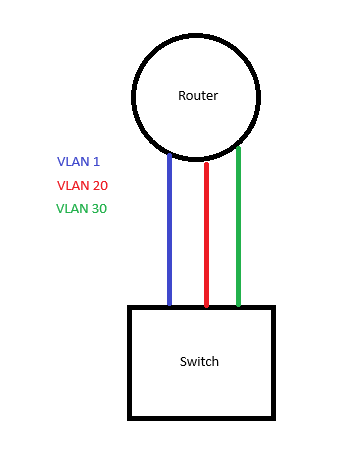
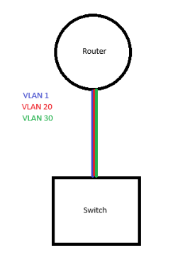

This section covers networking notes specific to this project; moments where configurations work on physical hardware but behave differently in a virtual environment. 

##
As of 7/11, there is no VLAN playbook as I have to think of how to connect via SSH manually before I make the playbook (that's how I'm approaching Ansible: do it manually first and then automate it). I'm thinking that I have to do bastion jump host again but I will make a new section in the AnsibleNotes.md called 'VLAN Playbook' detailing the switch configurations. Once the whole network is communicating, I will make a DHCP pool playbook then a banner playbook to finish things off. When everything is completed, we will create a new network with the same playbooks and demonstrate with a video the capabilities of Ansible. 

## Things are changing again...

To give more context on top of the current one, the network will still use a Router-on-a-stick configuration. However, I'm changing my perspective on how EVE-NG works and it's sort of working:
- I have to consider that the EVE interface to the virtual network is a node on its own, so a router/bridge that is still included in the network even though it's not managed by the network. 

**Why?** 

Until now, I've been approaching EVE as a network simulating tool which this application is incredibly great at. However, it's not great at simulating real environments. I have been able to connect via SSH to each device directly which is great, however once we start connecting *through* the virtual devices, that's when I encounter so many issues.

### So what's changing this time?
---

I'm only connecting the router and the switch to the EVE node. This allows me to connect via SSH, push the playbooks, verify them. After verifying the playbooks, I'm going to *try* to attempt to configure a separate network within again and see if there's an opportunity to demonstrate Ansible at a great capacity. 

## New NEW Layout

[image will go here once I get the photo, designing the idea for the network on paper and through Cisco Packet Tracer]

# Below is still very good information but irrelevant for the project.
~~Why is there no VLAN 10?~~

~~To give context, I have to talk about the setup that I'm doing here: ***Router-on-a-stick***.~~

~~Router-on-a-stick, or InterVLAN routing as it can be called, works like this:
~~

~~A network has a router and a switch with 3 VLANs, while this is a valid configuration for separating traffic between VLANs, this is incredibly inefficient.~~

~~On the switch, you can **trunk** the connection between the router and switch to have all VLAN related communication go through the same port instead of **3** ports to do the same thing.~~

~~And that's how my network currently works but there's an issue related to EVE-NG... You can configure VLAN 10, 20, 30 with their respective sub-interfaces on the router just fine on real hardware but virtually, there is a quirk that doesn't allow that. I must have VLAN 1 configured otherwise the router and switch cannot communicate. I have no idea if that's something that can be fixed but this is the approach I'm taking to finish this project.~~

